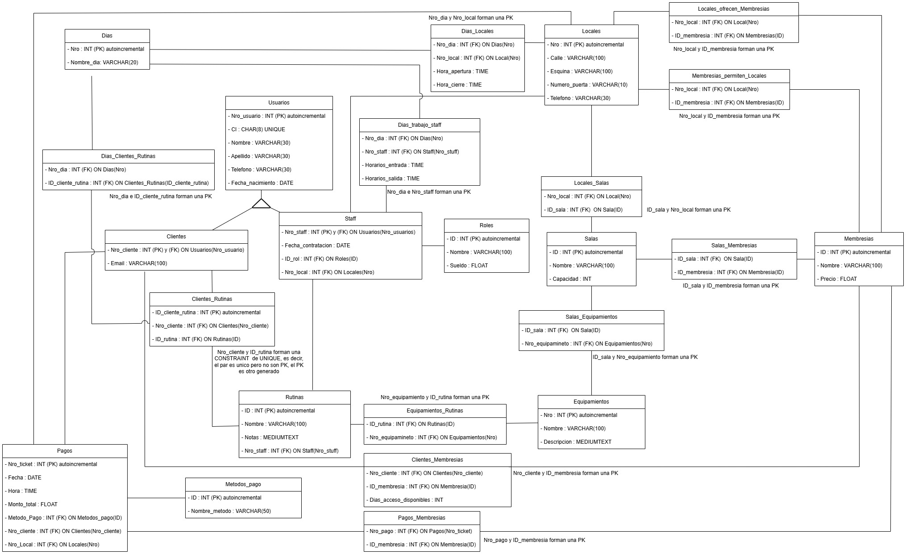

# 🏋️‍♂️ Sistema de Gestión de Gimnasio - DB Model

Este proyecto presenta el diseño y modelado de una base de datos relacional robusta para la administración integral de un gimnasio. El sistema abarca desde la gestión de usuarios y personal hasta el control de membresías, rutinas de entrenamiento y finanzas.

## 🚀 Características Principales

- **Arquitectura Relacional**: Implementación de 24 tablas normalizadas en **3FN** (Tercera Forma Normal).
- **Simulación de Herencia**: Uso de tablas especializadas para `CLIENTES` y `STAFF` vinculadas a una entidad base `USUARIOS`.
- **Control de Acceso y Horarios**: Gestión detallada de horarios por local y cronogramas de trabajo para el staff.
- **Sistema de Membresías**: Relación dinámica entre locales, salas accesibles y tipos de suscripción.
- **Seguimiento de Entrenamientos**: Vinculación de rutinas personalizadas con ejercicios y equipamiento específico.

## 📊 Diagrama de Entidad-Relación (DER)

A continuación, se presenta la estructura lógica del sistema:

👉 [Descargar Diagrama de Entidad-Relación (PDF)](./entrega%201/DER%202FN%20y%203FN.pdf)

---

## 📂 Estructura de la Base de Datos

El sistema se divide en 12 entidades principales y 12 tablas relacionales para manejar la complejidad del negocio:

### Entidades Principales (12)
- **USUARIOS**: Datos personales básicos de toda persona vinculada al gimnasio.
- **CLIENTES / STAFF**: Tablas especializadas que extienden la información de usuarios.
- **LOCALES / SALAS**: Gestión de sucursales y sus espacios físicos.
- **RUTINAS / EQUIPAMIENTOS**: Definición de planes de entrenamiento y catálogo de máquinas.
- **MEMBRESIAS**: Planes de suscripción disponibles.
- **PAGOS / METODOS_PAGO**: Registro financiero de transacciones.
- **DIAS**: Entidad auxiliar para la gestión de calendarios.

### Tablas Relacionales Destacadas (12)
- **CLIENTES_MEMBRESIA**: Control de acceso y días disponibles por socio.
- **DIAS_TRABAJO_STAFFS**: Cronograma horario por empleado.
- **SALAS_MEMBRESIAS**: Define qué áreas del gimnasio permite usar cada plan.
- **EQUIPAMIENTOS_RUTINAS**: Detalle de qué máquinas se necesitan para cada rutina.

---

## 🛠️ Aspectos Técnicos

- **Normalización**: El diseño asegura la eliminación de redundancias y la integridad de los datos mediante una correcta aplicación de dependencias funcionales.
- **Integridad Referencial**: Uso estricto de Claves Primarias (PK) y Claves Foráneas (FK) para mantener la consistencia en todas las operaciones de CRUD.
- **Escalabilidad**: La separación de entidades permite añadir nuevos módulos (como gestión de inventario o reservas de clases) sin afectar la estructura base.

---

## ✒️ Autor
[Rodrigo Rodriguez](https://github.com/rodrigonbg)

---
*Este proyecto fue desarrollado con fines educativos para demostrar habilidades en modelado de datos y diseño de sistemas relacionales.*
